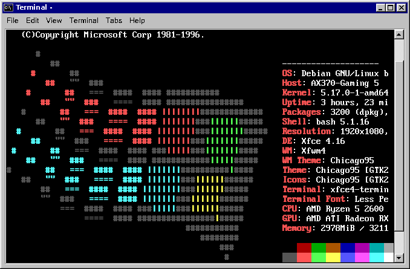
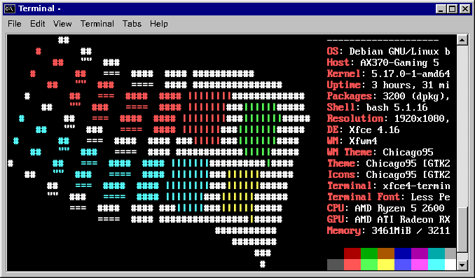

# Windows 9x Logo for Neofetch
Have you installed the [Chicago95 theme](https://github.com/grassmunk/Chicago95) but feel an emotional void when Neofetch shows your distro logo, breaking the illusion?

Well, here's a nice little solution:




To add it, just download the file neofetch_windows_95_logo, save it in a convenient path, and put this somewhere (preferably at the end of) ~/.bashrc with a text editor like nano, making sure to replace "(path to file)" with the path to the file (and remove your previous neofetch command if there was one):

Black Border:
```bash
neofetch --ascii (path to file) --ascii_colors 0 1 2 6 3
```

White Border:
```bash
neofetch --ascii (path to file) --ascii_colors 7 1 2 6 3
```
